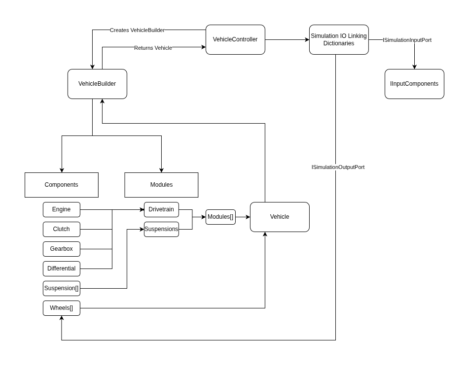

# Vehicle Physics Simulation System

A comprehensive vehicle physics simulation system built for Unity, focusing on realistic drivetrain, suspension, and wheel dynamics.

## Overview

This project implements a modular vehicle simulation system with separate concerns for drivetrain mechanics, suspension dynamics, and wheel physics. The architecture uses a component-based design with clear separation between simulation logic and Unity integration.


## Architecture

### Module-Component Pattern

```
Vehicle
├── Modules (runtime simulation)
│   ├── DrivetrainModule
│   ├── SuspensionSystem
│   └── AutoShiftingModule
└── Components (isolated logic)
    ├── Engine
    ├── Clutch
    ├── Gearbox
    ├── Differential
    ├── Suspension (per-wheel)
    └── Wheel (per-wheel)
```

### Simulation Sequence
#### Initializatoin Sequence

1. `VehicleController` creates `VehicleBuilder`.
2. `VehicleBuilder` returns built `Vehicle`.
3. `VehicleController` creates IO linking dictionaries for `IInputComponent` and `Wheel`.
4. Calls awake on `IInputComponents` and Activate `Vehicle`.

#### Update Sequence
1. Run `ControllerEarlyUpdate()` on `IInputComponents` (Unity Monobehaviours) to read input via `ISimualtionInputPort`.
2. Read player input via `UpdateVehicleContext()`.
3. Run `FixedUpdate` on `Vehicle`.
    - Runs `Setup()` on each wheel to distribute inputs from IInputComponents via `ISimulationOutputPort`.
    - Runs `FixedUpdates()` on each module.
    - Runs `Simulate()` on each wheel to distribute output to IInputComponents via ISimulationOutputPort.
4. Run `ControllerLateUpdate()` on `IInputComponents` to apply simulation outputs.

### Port Pattern

Communication between modules, `Wheels` and `IInputComponents` uses port interfaces:
- `IModulePort` - Module -> Wheel
- `IWheelPort` - Wheel -> Module
- `ISimulationInputPort` - `IInputComponents` -> Simulation (`Wheel`)
- `ISimulationOutputPort` - Simulation (`Wheel`) -> `IInputComponents`

Ports are interface on intermediate data holding class/struct.

## Usage

1. Create a `VehicleConfig` ScriptableObject
2. Assign config to `VehicleController`
3. Set up GameObjects with `WheelMB` and `SuspensionMB` components (refer to `Assets/Scenes/VehiclePhysicsDemo.unity` scene for demo setup.)
4. Make sure a `PlayerInputs` component exists for input (or implement `IVehicleInputProvider`)

## Features

- Modular architecture with clear separation of concerns  
- Realistic multi-stage drivetrain simulation  
- Per-wheel suspension and tire physics  
- Automatic gear shifting with clutch control  
- Configurable via ScriptableObjects  
- Input abstraction for custom controllers  
- Debug visualization and telemetry  

## Status

See [TODO](TODO.md) for current development progress and planned features.
